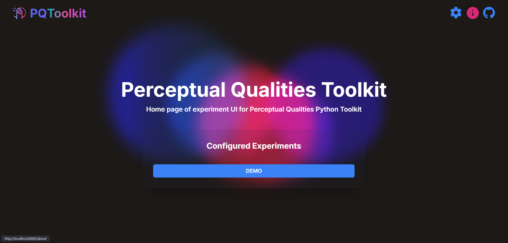
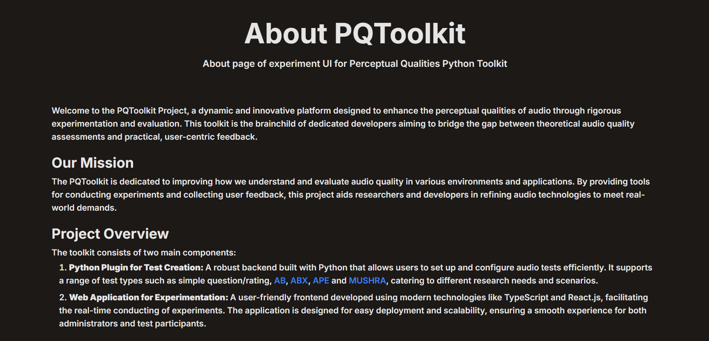

# Perceptual Qualities Python Toolkit

## Up-to-Date Installation and User Manual
- Requirements [Requirements](#requirements)
- Installation Steps [Installation Steps](#installation-steps)
- How to Start the Web Application [How to Start the Web Application](#how-to-start-the-web-application)
- How to create revisions [How to create revisions](#how-to-create-revisions)

---

### Requirements
- Python 3.7-3.12
- Docker
- Poetry
- Make

---

### Installation Steps
1. Navigate to `src/pq-toolkit`.
2. Run `poetry install`.
3. The application is now ready to run.

---

### How to Start the Web Application
1. Navigate to `src/deployments`.
2. Fill in the required `.env.[flavor]` file according to the `.env.[flavor].sample` file (e.g., `.env.dev`).
3. Navigate to `src/`.
4. *(Optional)* Start Docker if it is not already running.
5. Run `make build-[flavor]` to build the Docker image (e.g., `make build-dev`).
6. Run `make start-[flavor]` to deploy the Docker image (e.g., `make start-dev`).
7. To stop an image, use `make stop-[flavor]` (e.g., `make stop-dev`).

### Available Flavors
- **prod**: Production environment version.
- **stage**: Staging environment version (similar to production).
- **dev**: Development environment version.

---

### How to create revisions

1. Make sure you have `.env.prod` file in `src/deployments` directory
2. Go to `src/`
3. Run `make alembic-shell`
4. Execute alembic commands in the shell
5. Exit the shell
6. Run `make alembic-stop`

All the revisions are automatically applied at startup.

---

### About page
1. Go to localhost:8000/about or press the icon in the top right corner of the page\

2. You can now navigate to the about page\

3. Here you can see links to pages about different testing methods
