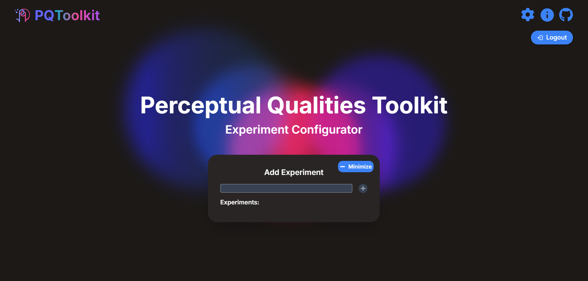
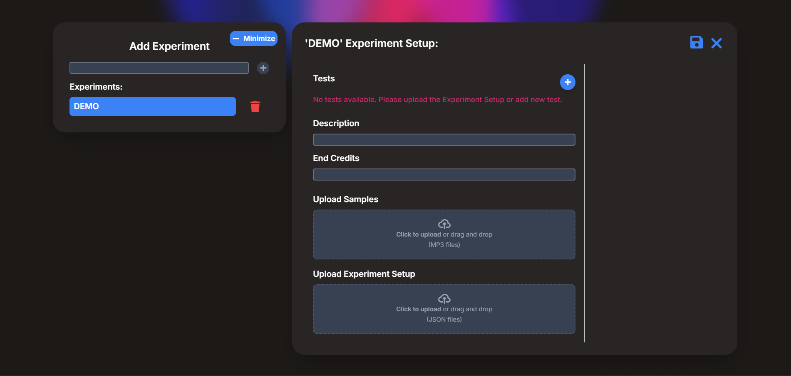
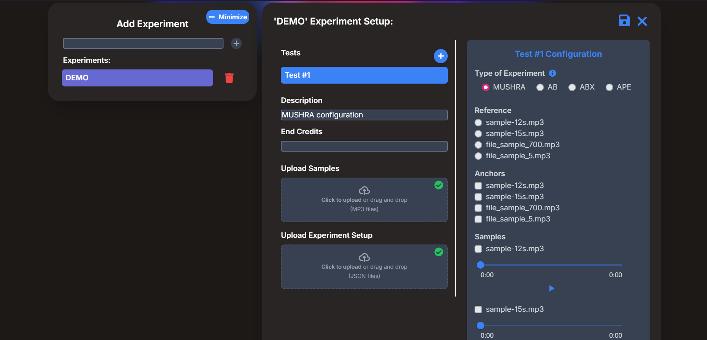
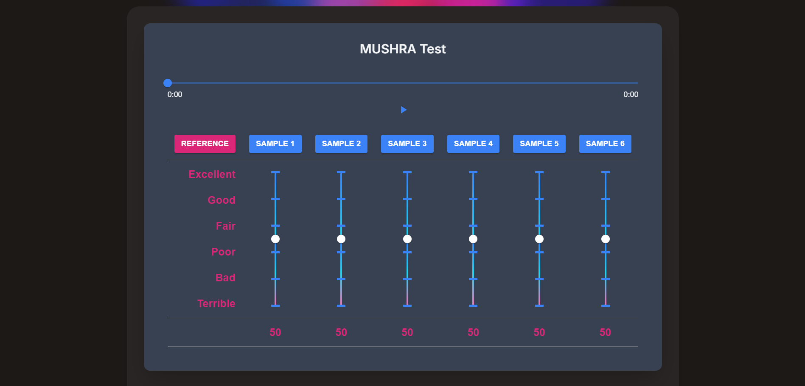

# Perceptual Qualities Python Toolkit

## Installation and User Manual
- Requirements [Requirements](#requirements)
- Installation Steps [Installation Steps](#installation-steps)
- How to Start the Web Application [How to Start the Web Application](#how-to-start-the-web-application)
- How to create revisions [How to create revisions](#how-to-create-revisions)
- About page [About page](#about-page)
- How to create experiments [How to create experiments](#how-to-create-experiments)

---

### Requirements
- Python 3.7-3.12
- Docker
- Poetry
- Make

---

### How to Install Start the Web Application
1. Navigate to `src/deployments`.
2. Fill in the required `.env.[flavor]` file according to the `.env.[flavor].sample` file (e.g., `.env.dev`).
3. Navigate to `src/`.
4. *(Optional)* Start Docker if it is not already running.
5. Run `make build-[flavor]` to build the Docker image (e.g., `make build-dev`).
6. Run `make start-[flavor]` to deploy the Docker image (e.g., `make start-dev`).
7. To stop an image, use `make stop-[flavor]` (e.g., `make stop-dev`).

### Available Flavors
- **prod**: Production environment version.
- **stage**: Staging environment version (similar to production).
- **dev**: Development environment version.

---

### How to create revisions

1. Make sure you have `.env.prod` file in `src/deployments` directory
2. Go to `src/`
3. Run `make alembic-shell`
4. Execute alembic commands in the shell
5. Exit the shell
6. Run `make alembic-stop`

All the revisions are automatically applied at startup.

---

### About page
1. Go to localhost:8000/about or press the icon in the top right corner of the page\

2. You can now navigate to the about page\

3. Here you can see links to pages about different testing methods

---

### How to create experiments

1. Go to localhost:8000/admin
2. Log in as admin
3. Create a new experiment with the desired name\

4. You can now upload a configuration file (setup.json) and samples for the experiment\


5. All users can now see the experiment on the main page\


6. Don't forget to write your feedback at the end.

---

### How to use the python toolkit (THIS FUNCTION IS DEPRECATED)

1. You can also create experiments using the python toolkit
2. Find use examples in the `src/pq-toolkit/examples` directory
3. Experiments created with the toolkit will be automatically uploaded to the web application
4. Example code:
```python
experiment_setup = PqExperiment(
        name="Test 1",
        description="Some test suite",
        tests=[
            PqTestAB(
                test_number=1,
                samples=[
                    PqSample(sample_id="s1", asset_path="file_sample_5.mp3"),
                    PqSample(sample_id="s2", asset_path="file_sample_700.mp3"),
                ],
                questions=[
                    PqQuestion(question_id="q1", text="Select better quality"),
                    PqQuestion(question_id="q2", text="Select more warmth"),
                ],
            ),
            PqTestABX(
                test_number=2,
                samples=[
                    PqSample(sample_id="s1", asset_path="file_sample_5.mp3"),
                    PqSample(sample_id="s2", asset_path="file_sample_700.mp3"),
                ],
                questions=[
                    PqQuestion(question_id="q1", text="Select better quality"),
                    PqQuestion(question_id="q2", text="Select more warmth"),
                ],
            ),
            PqTestAPE(
                test_number=3,
                samples=[
                    PqSample(sample_id="s1", asset_path="file_sample_5.mp3"),
                    PqSample(sample_id="s2", asset_path="file_sample_700.mp3"),
                    PqSample(sample_id="s3", asset_path="sample-12s.mp3"),
                ],
                axis=[
                    PqQuestion(question_id="a1", text="Quality"),
                    PqQuestion(question_id="a2", text="Depth"),
                ],
            ),
            PqTestMUSHRA(
                test_number=4,
                reference=PqSample(sample_id="ref", asset_path="file_sample_5.mp3"),
                anchors=[
                    PqSample(sample_id="a1", asset_path="file_sample_700.mp3"),
                    PqSample(sample_id="a2", asset_path="file_sample_5.mp3"),
                ],
                samples=[
                    PqSample(sample_id="s1", asset_path="sample-12s.mp3"),
                    PqSample(sample_id="s2", asset_path="sample-15s.mp3"),
                    PqSample(sample_id="s3", asset_path="sample-12s.mp3"),
                    PqSample(sample_id="s4", asset_path="sample-15s.mp3"),
                    PqSample(sample_id="s5", asset_path="sample-12s.mp3"),
                    PqSample(sample_id="s6", asset_path="sample-15s.mp3"),
                ],
            ),
        ],
    )
```
